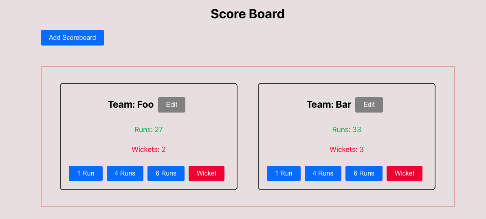
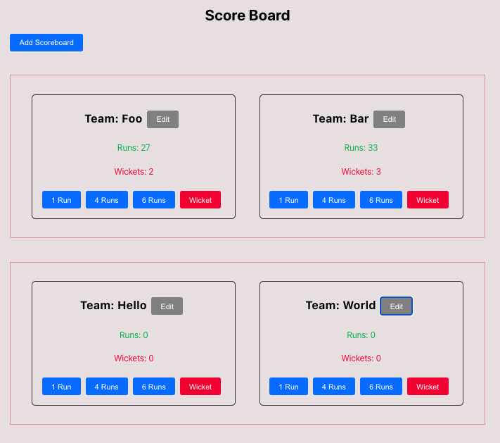

# Scoreboard React JS

Welcome to the Scoreboard React JS project! This web application allows you to add and manage cricket scoreboards.




## Table of Contents

- [Getting Started](#getting-started)
  - [Prerequisites](#prerequisites)
  - [Installation](#installation)
  - [Configuration](#configuration)
- [Running the Application](#running-the-application)
- [Testing](#testing)
- [Deployment](#deployment)
- [Contributing](#contributing)
- [License](#license)

## Getting Started

### Prerequisites

Before you begin, ensure you have the following prerequisites installed:

- [Node.js](https://nodejs.org/): You'll need Node.js to run the application.
- [npm](https://www.npmjs.com/) or [Yarn](https://yarnpkg.com/): npm comes pre-installed with Node.js, but you can use Yarn as an alternative package manager.

### Installation

To get started, follow these steps:

1. Clone this repository to your local machine:

   ```bash
   git clone https://github.com/rasmiru/scoreboard.git
   ```

2. Change your current directory to the project folder:

   ```bash
   cd scoreboard
   ```

3. Install the project dependencies using npm or Yarn:

   ```bash
   npm install
   # or
   yarn install
   ```

## Running the Application

To run the project locally, use the following command:

```bash
npm start
# or
yarn start
```

This command will start the development server, and the application will be accessible at [http://localhost:3000](http://localhost:3000) in your web browser.

## Testing

To run tests for the application, you can use the following command:

```bash
npm test
# or
yarn test
```

This will run the test suite and display the test results in the terminal.

## Deployment

To deploy the project to a production environment, you can use various hosting platforms and CI/CD pipelines depending on your preferences. Some popular options include:

- [Netlify](https://www.netlify.com/)
- [Vercel](https://vercel.com/)
- [GitHub Pages](https://pages.github.com/)

Please refer to the documentation of your chosen hosting platform for deployment instructions specific to that service.

## Contributing

If you'd like to contribute to this project, please follow these guidelines:

1. Fork the repository on GitHub.
2. Create a new branch for your feature or bug fix.
3. Make your changes and commit them with clear and concise commit messages.
4. Push your changes to your fork.
5. Create a pull request from your fork to the main repository.

We welcome contributions from the community!

## License

This project is licensed under the MIT License. Please see the [LICENSE](LICENSE) file for details.
